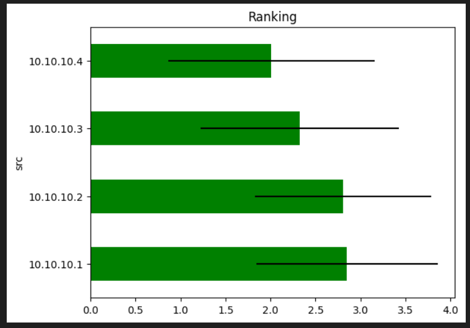
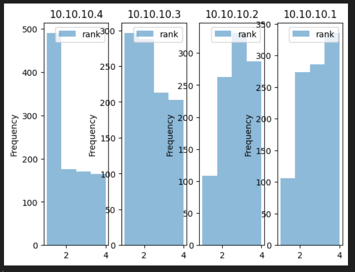

# Automated trading : find the fastest lines to the Exchange

## Connection to the exchanges

Automated trading involves the use of direct connections to the Exchanges via dedicated lines.
To ensure redundancy and scalability, usually multiple lines are used: the pricing data are
strictly identical across lines. The only difference is the arrival time to the trading machine.

## Fastest lines

Therefore it is crucial to use the fastest lines.  
And to reduce the costs (each line is charged by the exchange), it is not necessary to keep the slowest lines.

## PCAP

The pricing data are transmitted over UDP multicast.
In order to analyse the arrival time of the pricing data, the packets are captured into a PCAP file.

## Analysis

This jypiter notebook analyses this PCAP file, calculates a metric and visualises the results in order
to find the fastest lines in a objective manner.

***
#### Below the results : the ranking of each source.  

It is possible now to objectively decide to keep on only the lines 10.10.10.4 (the fastest by far) and 10.10.10.3 as a backup.  
The other 2 lines are much slower and can be discarded.
***

